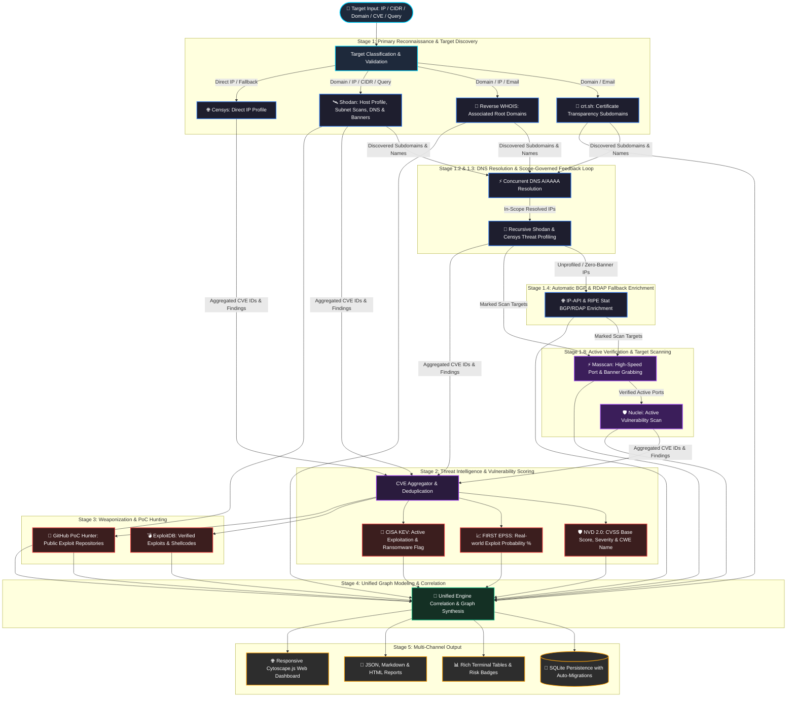

<h1 align="center">DetecTI - Cyber Lead Intelligence</h1>

<div align="center">


### Modern External Attack Surface Mapping & Threat Intelligence Engine
**Asynchronous • Modular • High-Concurrency • EPSS + CISA KEV Prioritization • Masscan & Nuclei Active Scanning • Shodan • Censys • crt.sh • Reverse WHOIS**

[](https://detecti.com.br)
[](https://detecti.com.br/docs/detecti-cli/en.html)
[](https://www.python.org/downloads/)
[](https://opensource.org/licenses/MIT)
[](https://docs.pydantic.dev/)

</div>

---

## 📚 Official Documentation & Introduction

> 📖 Complete guides, installation, CLI usage, architecture, and threat intelligence scoring are available in the [**DetecTI-CLI Official Documentation**](https://detecti.com.br/docs/detecti-cli/en.html).

### 🛡️ About DetecTI - Cyber Lead Intelligence
**DetecTI-CLI** (officially **DetecTI - Cyber Lead Intelligence**) is an enterprise-grade cyber intelligence and External Attack Surface Management (EASM) platform engineered by [DetecTI Security](https://detecti.com.br). It serves as the primary execution engine of the proprietary **R.A.D.A.R. Framework** (*Reconnaissance, Analysis, Diagnosis, Assessment, and Resolution*), materializing the organization's institutional pillars: *Open Source Collaboration*, *Technical Excellence*, *Ethical Hacking*, and *Pragmatism*.

In cybersecurity operations, a **Cyber Lead** is an exposed asset or attack vector discovered, enriched with threat intelligence, actively validated, and qualified by its real-world exploitation risk. DetecTI-CLI transforms noisy internet telemetry into qualified, prioritized intelligence so security teams can focus on what matters most.

---

## 🚀 Overview

**DetecTI - Cyber Lead Intelligence** is a high-performance Python 3.11+ engine designed for **External Attack Surface Management (EASM)**, **Active & Passive Asset Reconnaissance**, and **Vulnerability Weaponization Intelligence**.

It maps exposed internet infrastructure (domains, subdomains, IPs, open services, and banners), correlates organizational relationships via **Reverse WHOIS** and **Certificate Transparency**, executes high-speed active verification with **Masscan**, performs targeted vulnerability validation with **Nuclei** strictly against verified active endpoints (*Verified Active Rule*), and enriches identified CVEs with real-world exploitation risk data (**FIRST EPSS + CISA KEV**), weakness taxonomy (**CWE Name**), provenance tracking (**Vulnerability Source**), and public weaponization proofs (**ExploitDB + GitHub PoCs**).

---

## 🔄 Engine Data Flow & Correlation Pipeline

The DetecTI engine executes an asynchronous, multi-stage pipeline designed to discover, correlate, and prioritize internet-facing attack surfaces with threat intelligence feeds.



### 🔍 Step-by-Step Data Flow:

1. **Target Classification & Scope Governance**:
   - Categorizes input into `IP`, `CIDR range`, `Domain`, `CVE-ID`, `Email`, `Organization Query (org:)`, `ASN Query (asn:)`, `Custom Query`, or `Batch File`.
   - **Strict Scope Governance for Org / ASN Targets**: When targeting organizations (`org:"..."`) or autonomous systems (`asn:"..."`), the engine strictly constrains the attack surface to assets owned by the target, quarantining foreign third-party IPs (e.g. CDNs or external providers) from polluting the inventory.

2. **Stage 1: Primary Reconnaissance & Target Discovery**:
   - **Shodan**: Primary discovery engine for custom queries, CIDR subnets, direct IP lookups, and host profiles.
   - **Certificate Transparency (crt.sh)**: Discovers issued TLS/SSL certificates to uncover wildcards and hidden subdomains.
   - **Reverse WHOIS (WhoisFreaks API + HackerTarget fallback)**: Identifies associated parent/child domains registered by the same organization.
   - **Shared CDN / Anycast Reverse IP Bypass**: Automatically detects if the target domain or IP resides on shared CDN/Anycast edge proxies (Cloudflare, Fastly, Akamai, Imperva) and skips Reverse IP Lookups, preventing unrelated tenant websites from polluting the reconnaissance inventory.
   - **Censys (Direct IP Lookups)**: Queries host profiles for direct single IP targets or primary fallback.

3. **Stage 1.2 & 1.3: DNS Resolution & Recursive Threat Intel Feedback Loop**:
   - Asynchronously resolves discovered subdomains and domains to their active `A`/`AAAA` IP addresses.
   - **Target Domain Tree Scope Enforcement**: When scanning domain targets, DNS resolution and host node creation are strictly confined to the target domain's registered tree (`target.com` and `*.target.com`), ensuring third-party hosting infrastructures never spawn extraneous network nodes.
   - In-scope IPs are fed into a recursive intelligence feedback loop (Shodan & Censys) to uncover full open port maps, services, and passive CVEs.

4. **Stage 1.4: Automatic BGP / RDAP Fallback Enrichment**:
   - For hosts discovered via DNS or CT logs that return 0 indexed services on search engines, the engine automatically performs non-blocking BGP routing and RDAP lookups (via IP-API and RIPE Stat) to populate **ASN**, **Organization name**, **Country**, **City**, **Region**, and **GPS Coordinates**.

5. **Stage 1.8: Target Management & Active Scanning (Masscan + Nuclei)**:
   - **Masscan Active Port Scan**: Targets marked on the graph are scanned at high speeds with banner grabbing (`--banners`) to verify live exposed services.
   - **Smart Port Exclusion & 2-Phase Pipeline**: Automatically omits already confirmed active ports to minimize load. When scanning All Ports (`0-65535`), Phase 1 immediately tests known passive unverified ports for rapid visual feedback, followed by Phase 2 sweeping remaining ports.
   - **Mandatory "Verified Active" Rule for Nuclei**: Nuclei strictly targets endpoints confirmed as **"Verified Active"**. If an IP target has unverified passive ports in the database, Nuclei requests a targeted Masscan pre-scan specifically for those passive ports. If verified active, Nuclei proceeds; otherwise, if no ports respond or no ports are mapped, the scan is safely skipped with an explanatory log in the console.

6. **Stage 2: Threat Intelligence & Vulnerability Prioritization**:
   - All unique CVE IDs identified across passive feeds and active Nuclei scans are aggregated and tracked by their provenance (**Vulnerability Source**: `Nuclei`, `NVD`, etc.).
   - Prioritized via the **3D EASM Risk Matrix**: **CISA KEV** (P1 Active Exploitation) > **Weaponized PoCs & Exploits** > **FIRST EPSS Probability** > **CVSS Severity**.
   - **NVD 2.0 API**: Retrieves official CVSS v3.1, v3.0, and v2.0 base scores, vector metrics, and **CWE (Common Weakness Enumeration)** weakness name.
   - **FIRST EPSS API**: Appends real-world exploitation probability percentages (0.0% to 100%) and percentile scores.
   - **CISA KEV Catalog**: Cross-checks vulnerabilities actively leveraged in ransomware and targeted cyber campaigns.

7. **Stage 3: Weaponization & PoC Hunting**:
   - **ExploitDB (searchsploit)**: Matches CVEs against local exploit scripts, PoCs, and shellcodes with verification tags.
   - **GitHub PoC Intelligence**: Queries real-world public exploit repositories and verification status.

8. **Stage 4: Graph Modeling & Relational Synthesis (Host-Centric & Target-Driven)**:
   - Binds assets into a streamlined, high-performance attack chain topology:
     $$\text{TARGET\_ROOT} \xrightarrow{\text{CONTAINS\_TARGET}} \text{HOST IPs / FQDN TARGETS} \xrightarrow{\text{EXPOSES / RESOLVES\_TO}} \text{SERVICES} \xrightarrow{\text{HAS\_VULN}} \text{CVEs}$$
   - Enumerated passive domains and subdomains are embedded directly into the `target_root` searchable inventory and within Host IP metadata badges (`🌐 N FQDNs`), liberating canvas space and boosting rendering performance.

9. **Stage 5: Persistence & Presentation**:
   - Stores all relationships in a relational SQLite database with auto-migration support.
   - Outputs formatted JSON, Executive Markdown, standalone HTML reports, and interactive web visualization graphs with direct references to [DetecTI Security](https://detecti.com.br).

---

## ⚡ Key Features

- **🌐 Infrastructure & Asset Mapping**:
  - Direct IP, CIDR subnets (`192.168.1.0/24`), Domain, Organization (`org:`), ASN (`asn:`), and custom search query support.
  - Port, service, product, version, and banner discovery.
  - Automatic web service URL construction (`http://` vs `https://`).
  - **Automatic BGP / RDAP Fallback Enrichment**: Unprofiled hosts are enriched in real-time with ASN, Organization, City, Region/State, Country, and geographic coordinates (Latitude/Longitude) with interactive Google Maps links in the Asset Inspector.
- **🔍 Subdomain & Domain Correlation & Scope Governance**:
  - **Certificate Transparency (crt.sh)** for comprehensive subdomain enumeration.
  - **Reverse WHOIS & CDN Proxy Bypass**: Correlates domains by registrant email, organization name, or domain (WhoisFreaks API + HackerTarget fallback), automatically bypassing Reverse IP queries on shared CDN edge proxies to eliminate tenant noise.
  - **Target Domain Tree Scope Enforcement**: Strictly bounds DNS resolution and host network synthesis to the target domain's registered tree (`*.target.com`).
  - **Authoritative DNS Resolution Isolation (Subdomain ➔ IP)**: Every subdomain links strictly and exclusively to its directly resolved IP addresses in DNS/TLS certificates, preventing any cross-contamination or spurious associations between sibling subdomains.
  - **Strict Scope Governance for Org / ASN Targets**: Guarantees that only infrastructure owned by the target is registered in the database, discarding external third-party IPs.
  - Shodan DNS historical record mapping.
- **🛡️ Advanced Threat Intelligence & Risk Prioritization**:
  - **3D EASM Risk Matrix**: Intelligent sorting placing actively exploited CISA KEV flaws, weaponized PoCs, and high EPSS probability at the top.
  - **NVD 2.0 API**: CVSS base scores, severity levels, and **CWE Name** weakness mapping.
  - **FIRST EPSS**: Exploit Prediction Scoring System (probability percentage & percentile).
  - **CISA KEV**: Catalogs vulnerabilities actively exploited in real-world attacks & ransomware campaigns.
  - **ExploitDB & GitHub PoCs**: Direct links to public exploits and proof-of-concept repositories.
  - **Source Provenance Tracking**: Clear visibility of where each vulnerability was identified (`Nuclei`, `NVD`, etc.) in all graph views, node inspectors, and Risk Metrics accordions.
- **💻 Interactive & Fully Responsive Web Dashboard (DetecTIHound)**:
  - Asynchronous FastAPI web server rendering rich EASM network graphs with Cytoscape.js.
  - **Host-Centric & Target-Driven Architecture**:
    - **Clean Attack Chain**: Direct topological flow from `Target Root ──(CONTAINS_TARGET)──► Host IPs ──(EXPOSES)──► Services ──(HAS_VULN)──► CVEs`.
    - **Asset Inspector DNS Inventories**: Clicking the `target_root` anchor displays complete searchable accordions for `🌐 Enumerated Domains (X)` and `🏷️ Enumerated Subdomains (Y)` with instant filtering, copy controls, and 1-click **`Set as Target (FQDN)`** actions.
    - **On-Demand FQDN Materialization**: Marking an FQDN as an active scan target materializes it on the canvas (`Target Root ──(CONTAINS_TARGET)──► FQDN ──(RESOLVES_TO)──► Host IP`).
    - **Compact IP Badges**: Host IPs display clean metadata chips (`🌐 N FQDNs`) with expandable Virtual Hosts in the Asset Inspector.
  - **Lead Selector Zero-Render Default & Smart Scan Preservation**:
    - **Clean Initial Load**: On database load or database switch, leads start unchecked by default with an empty canvas ready for tactical query exploration.
    - **Real-Time Post-Scan Preservation**: When active scans (Masscan / Nuclei) complete, active lead selections are preserved seamlessly so newly discovered open ports, services, and CVEs appear on screen without resetting analyst workflow.
  - **Strict Attack Path Isolation in Filtering**: When applying risk or vulnerability filters (Critical, CISA KEV, High EPSS, 3D Risk Matrix), the graph isolates the exact single-lineage attack path (`Target Root ──► Host IP ──► Service / Port ──► CVE`), pruning 100% of non-vulnerable IPs and background noise.
  - **Bidirectional Inspector Navigation**:
    - Inspecting a **Host IP** displays all active **Associated FQDNs & Virtual Hosts** with dedicated focus and filter buttons.
    - Inspecting an **FQDN Target** displays its **Resolved IP** with a 1-click `[ ⌖ Focus ]` crosshair button.
  - **Hierarchical (Left-Right, Default) DAG Layout**:
    - Left-to-Right orientation flowing from `Target Root (x=0)` $\rightarrow$ `FQDN Targets / Host IPs (x=280)` $\rightarrow$ `Services (x=IP.x+110)` $\rightarrow$ `CVEs (x=Srv.x+80)`.
    - Matrix grid supporting up to 9 Host IPs per vertical column with dynamic clearance to eliminate node overlap across large enterprise ranges.
  - **Retractable Filters & Controls Drawer**: Smoothly collapse the left sidebar to liberate 100% of the screen for graph exploration across all desktop and mobile devices.
  - **Clean & Focused Asset Inspector**: Dedicated strictly to technical metadata, CWE descriptions, affected ports, IP geolocation, associated domains, weaponized exploit URLs, banner metadata, and explicit vulnerability **Source** attribution.
  - **Intuitive Mouse Navigation & Node Organization**:
    - **Left-Click (Drag)**: Pan and navigate smoothly across the canvas.
    - **Left-Click (Node)**: Select single node and inspect deep asset metadata in the Asset Inspector.
    - **Ctrl + Left-Click (Node)** / **Cmd + Left-Click**: Additive sequential multi-selection of target nodes.
    - **Right-Click (Node)**: Custom Context Menu to Collapse/Uncollapse Services or Vulnerabilities, Set/Remove Targets (IPs and FQDNs), Remove Verified Active, Focus Node, or Copy Domain/IP/CVE identifiers.
    - **Right-Click (Drag)**: Box area selection to group and reposition multiple nodes together.
    - **Smooth Scroll Wheel**: Seamless zoom in/out centered directly at the cursor position.
  - **Granular Graph Filters**:
    - `CISA KEV (Known Exploited)`
    - `High EPSS (>50% Exploit Probability)`
    - `Critical Vulnerabilities (CVSS 9.0+)`
    - `Hide Low & Info Findings`
    - `Nuclei Scan Findings Only`
    - `Verified Public PoCs / Exploits`
    - `Exposed Services Branches`
    - `Verified Active Services Only`
    - `Vulnerable Services Only`
  - **Visual Topology & Semantic Relationships**: Interactive graph engine with distinct node geometry, high-contrast colors (Electric Purple root query anchor, turquoise FQDN targets, purple IPs, orange/green service hexagons, red CVE diamonds, and crimson CISA KEV highlights), and directed relationship edges.
  - **Dynamic Database Switcher**: Seamlessly switch between any saved SQLite databases without server restart (including a rich pre-packaged demo dataset in `example.com.sqlite`).
  - **Export Data Menu**: One-click download of active scan data in **JSON**, **Executive Markdown**, and **Standalone HTML** formats.
  - **Floating Action Controls**: Instant access to `📐 Fit to Screen`, `🔍 Reset Zoom`, `🔄 Re-layout`, and **Layout Selector** (`🌳 Hierarchical (Left-Right, Default)`, `🌐 Force-Directed`, `🎯 Concentric`, `▦ Grid`).
  - **Smart Collapsible Clusters (High Fan-Out Optimization)**: Group high-density services or vulnerabilities into clean, collapsible cluster nodes with a dashed border.
- **🎯 Target Management & High-Speed Active Port Scanning (Masscan)**:
  - **Hybrid IP & FQDN Target Scanning**:
    - **FQDN Targets for Reverse Proxies / CDNs / Virtual Hosts**: In environments protected by Cloudflare, AWS CloudFront, Akamai, or Nginx/Apache Virtual Hosts, direct IP scanning fails due to TLS SNI requirements and HTTP `Host:` headers. DetecTIHound allows setting **Domains and Subdomains directly as scan targets** (**Set as Target (FQDN)**).
    - **Dynamic FQDN-to-IP Live Resolution & Automatic Graph Linkage (`RESOLVES_TO`)**: When an FQDN is scanned, the engine performs live authoritative DNS resolution:
      - **New Unlisted IP**: Dynamically creates a new IP node in the database and on the graph, binding it with a direct **`RESOLVES_TO`** edge from the FQDN.
      - **Existing IP**: If the resolved IP already exists on the graph but was disconnected or linked elsewhere, the direct **`RESOLVES_TO`** edge is automatically created and rendered connecting the FQDN to that IP.
      - **Service Port Sync**: Existing passive ports on that IP are promoted to **`Confirmed Active`** (with `"Masscan"` appended to sources), and newly discovered active ports are dynamically created under the host IP.
    - **Multi-Source Strict Service Deduplication**: Prevents duplicate service entries per `(IP, Port, Protocol)` across passive recon and active scanning. Merges sources (`Shodan`, `Censys`, `Masscan`, `Nuclei`), enriches banners and version details, and ensures a clean 1:1 service port visualization in Cytoscape.
    - **Right-Click Target Marking & Bulk Selection**: Mark/unmark any individual `IP Address`, `Domain`, or `Subdomain` node as a scan target directly from the Cytoscape graph context menu (**Set as Target** / **Remove Target**). (Note: The abstract `target_root` node cannot be marked as an individual scan target).
    - **Bulk Target Addition on Root Nodes**: Right-click on any `Domain` or parent node to instantly mark or unmark **all associated descendant IPs** as scan targets in a single click (**Set all N IPs as Targets** / **Remove all N IPs from Targets**).
  - **Active Verification Reset (Remove Verified Active)**: Right-click individual active services or parent root nodes to reset active verification back to passive status for targeted re-scans without losing existing asset metadata.
  - **Smart Port Exclusion**: Automatically filters out ports already marked `Confirmed Active` to avoid duplicate scanning and save network bandwidth.
  - **2-Phase Pipeline for All Ports (0-65535)**: Phase 1 prioritizes unverified passive ports for immediate 1-2s visual confirmation, followed by Phase 2 batch sweep of remaining ports.
  - **Target Management Drawer**: Right-side sliding panel providing real-time target status (`Idle`, `Scanning`, `Completed`, `Failed`), discovered open port counts, port chips with banner tooltips, individual or bulk scan execution, and a live console output stream.
  - **Live Scan Indicator**: Pulsing **`Scanning...`** badge and visual status indicators on the Targets header button while port or vulnerability scans are executing in the background.
  - **Flexible Scan Presets & Rate Control**: Quick port profiles (*Top 100*, *Web Ports*, *All Ports 0-65535*, *Custom*), packet rate slider (100 to 10,000 pps), `-Pn` (disable ping), and `--banners` (banner grabbing & service detection).
  - **Visual Topology Differentiation**:
    - Marked target nodes display a pulsing **Neon Cyan (.is-target)** glow and active target status in Cytoscape.
    - Services awaiting active verification render in dark slate with dashed amber borders (`#f59e0b`).
    - Confirmed active services render in solid **Emerald Green (#27ae60)** with an emerald border and glow.
    - Active scan service connections render as solid **Emerald Green relationship edges** (`#2ecc71`).
- **🛡️ Active Vulnerability Scanning (Nuclei)**:
  - Integration with ProjectDiscovery's **Nuclei** engine for template-based vulnerability assessment against both raw IPs and FQDN endpoints (`https://<fqdn>`, `http://<fqdn>`).
  - **FQDN Findings Resolution**: Vulnerabilities identified against FQDN endpoints automatically resolve and bind to the connected host IP and its corresponding port in the database and graph.
  - **Mandatory "Verified Active" Enforcement on Raw IPs**: IP scans are strictly targeted at ports confirmed open and active via Masscan. Unverified passive ports trigger a targeted Masscan pre-scan verification prior to template execution. If unverified or unavailable, Nuclei safely skips with explicit rationale logged.
  - Configurable severity filters (Critical, High, Medium, Low, Info), protocol/template tags, rate limits, concurrency, and custom flags.
  - Automated database merging, deduplication, and immediate Cytoscape graph node generation with weaponized PoC linkage.
- **🎯 Target Anchoring & Active Recon Staging**:
  - Targets (IPs, CIDR subnets, domains, or target lists passed via `targets.txt`) without passive reconnaissance records on external search engines are automatically anchored as `Target (Awaiting Active Recon)` nodes.
  - Guarantees that every queried asset is mapped into the SQLite database and rendered in the DetecTIHound interactive graph, ready for active port discovery (Masscan) and vulnerability probing (Nuclei).
- **⚡ Domain-Level Rate Limiting & API Resilience**:
  - Automatic rate-limit synchronization with official API specifications (e.g. Shodan 1 request/second) to prevent HTTP 429 throttling.
  - Smart pre-flight validation caching and non-blocking retry-after handling during large batch file executions.
  - Exact API diagnostic messaging (`No information available for that IP.`, rate limit notifications) logged and attributed directly to each target in reports and console streams.
- **🔐 Pre-Flight API Verification & Sanity Checking**:
  - Built-in sanity layer (`config-check` and engine pre-flight) that filters dummy placeholder keys and verifies valid authentication before running scans, preventing silent 401/403 authorization errors.
- **📊 Executive & Structured Reporting**:
  - Automated local SQLite database persistence for mapped targets inside `./data/dbs/`.
  - Rich, interactive terminal tables with colored risk badges.
  - Structured **JSON** export (`--format json`).
  - Executive **Markdown** report generation (`--format markdown`) with official DetecTI Security attribution.
  - Standalone, styled **HTML** report generation (`--format html`) with print-to-PDF formatting.

---

## 📦 Installation

### Prerequisites
- **Python**: 3.11 or higher
- **Masscan** (Required for WebUI Active Port Scanning):
  - Masscan must be installed on your operating system and configured with appropriate Linux capabilities so the WebUI background workers can transmit raw network packets without requiring the web server to run as root.
  ```bash
  # Debian / Ubuntu / Kali Linux
  sudo apt install -y masscan

  # Arch Linux / Manjaro
  sudo pacman -S masscan

  # Fedora / RHEL
  sudo dnf install -y masscan

  # Grant non-root raw socket capabilities to allow WebUI execution:
  sudo setcap cap_net_raw,cap_net_admin,cap_net_bind_service+eip $(which masscan)
  ```
- **Nuclei** (Optional / Recommended for Active Vulnerability Scanning):
  - Nuclei should be installed and accessible in your system `PATH` to run active vulnerability scans from the WebUI.
  ```bash
  # Via Go:
  go install -v github.com/projectdiscovery/nuclei/v3/cmd/nuclei@latest

  # Via Binary / Homebrew / Package Manager (Debian/Ubuntu/Kali):
  sudo apt install -y nuclei   # If available in your distribution repo
  # Or download pre-built binary from https://github.com/projectdiscovery/nuclei/releases
  ```

### Quick Installation & Automated Setup
```bash
# 1. Download and install the package globally from PyPI
pip install detecti-cli

# 2. Run the automated setup routine
# (Bootstraps dependencies, configures capabilities, creates directories,
# and sets up your secure Web Dashboard admin credentials)
detecti-cli config-check --setup

# The command is now ready!
detecti-cli --help
```

---

## ⚙️ Configuration & API Diagnostics

DetecTI-CLI works out-of-the-box with free fallbacks (crt.sh, HackerTarget, EPSS, CISA KEV, GitHub PoC API), but you can configure API keys for full power:

Create a `.env` file (automatically cloned from `.env.example` during setup) or export environment variables:
```bash
# Required for Shodan queries
export SHODAN_API_KEY="your_shodan_api_key_here"

# Optional: Censys Platform API v3 PAT Token and Org ID
export CENSYS_PAT_TOKEN="your_censys_pat_token_here"
export CENSYS_ORG_ID="your_censys_org_id_here" # (Optional for multi-tenant orgs)

# Optional: Accelerates NVD API rate limits
export NVD_API_KEY="your_nvd_api_key_here"

# Optional: For structured WhoisFreaks reverse WHOIS lookups
export WHOISFREAKS_API_KEY="your_whoisfreaks_api_key_here"

# Optional: GitHub token for PoC queries
export GITHUB_TOKEN="your_github_token_here"
```

### Diagnostics & Automated Pre-requisite Configuration
Verify your environment health, Python packages, project directories, raw socket capabilities, and live API endpoints:
```bash
# Run diagnostics check
./detecti-cli config-check

# Automatically configure missing prerequisites, directories, and capabilities
./detecti-cli config-check --setup
```

---

## 💻 Usage & CLI Examples

### 1. Scan a Single IP or CIDR Subnet
```bash
# Scan single IP
./detecti-cli scan -t 142.250.191.68

# Scan CIDR range
./detecti-cli scan -t 142.250.191.0/24
```

### 2. Scan a Domain (Subdomains + Reverse WHOIS + Infrastructure)
```bash
./detecti-cli scan -t spacex.com
```

### 3. Scan a Batch Target List from File
Pass any file containing targets (one IP, CIDR, or domain per line) directly to `-t`:
```bash
./detecti-cli scan -t targets.txt
```
> 💡 **Tip**: Automatically validates API credentials once for the entire batch, provides live per-target progress updates, and maps all targets into a unified SQLite database and Cytoscape topology in DetecTIHound ready for active recon.

### 4. Scan a Specific CVE with EPSS, CISA KEV, and PoCs
```bash
./detecti-cli scan -t CVE-2021-44228
```

### 5. Advanced Shodan Search Queries
You can pass custom Shodan search queries directly into the target `-t` parameter. **Always enclose the query in double quotes ("")**.

```bash
# Search by Organization Name
./detecti-cli scan -t "org:'ACME LTDA'" -f acme.md

# Search by City and Open Service
./detecti-cli scan -t "city:'washington' port:8080" -o markdown -f washington.md

# Search by SSL Certificate Organization
./detecti-cli scan -t "ssl.cert.subject.cn:'SpaceX'"
```
> 💡 **Tip**: Explore all available search filters in the official [Shodan Search Filters Guide](https://www.shodan.io/search/filters).

### 6. Filter Vulnerabilities by CVSS Severity
```bash
./detecti-cli scan -t 142.250.191.68 --cvss critical
```

### 7. Automatic SQLite Database Persistence & DetecTIHound Launch
Target scans automatically save all correlated entities (Domains, IPs, Ports, Services, CVEs, PoCs) into `./data/dbs/{target_root}.sqlite` and automatically launch the **DetecTIHound** WebGUI:

```bash
# Scan a domain (automatically creates ./data/dbs/spacex.com.sqlite and starts Hound)
./detecti-cli scan -t spacex.com

# Scan a batch list of targets
./detecti-cli scan -t targets.txt

# Scan with custom database name
./detecti-cli scan -t 142.250.191.0/24 --create-db google_net
```
> 💡 All scan databases are centralized in `./data/dbs/` so both the CLI and DetecTIHound can automatically discover, list, and switch between them. (Note: Standalone CVE lookups like `CVE-2021-44228` do not create databases).

### 8. Export Reports (JSON, Markdown & HTML)
```bash
# Export Markdown executive report
./detecti-cli scan -t example.com -o markdown -f report.md

# Export standalone styled HTML report
./detecti-cli scan -t example.com -o html -f report.html

# Export JSON structured data
./detecti-cli scan -t example.com -o json -f report.json

# Export all formats to a directory
./detecti-cli scan -t example.com -o all -d ./reports
```

### 8. Update ExploitDB Database
```bash
./detecti-cli update-xdb
```

### 9. Interactive EASM Web Dashboard (DetecTIHound)
Explore the mapped attack surface visually via the interactive web application from previously saved SQLite databases:

```bash
# Start the DetecTIHound web dashboard (databases are selected dynamically directly in the Web UI)
./detecti-cli hound start

# List available databases from previous scans (stored in ./data/dbs)
./detecti-cli hound list-dbs

# Check the background server status
./detecti-cli hound status

# Stop the web server
./detecti-cli hound stop
```

#### 🌟 Web Dashboard & Cytoscape Graph Highlights:
- **🔒 Secure Authentication (JWT)**: Fully protected dashboard access. The `./detecti-cli setup` securely generates a persistent `JWT_SECRET_KEY` in your `.env` derived from your admin password. Includes 30-minute HttpOnly cookie expiration and explicit Session Termination controls.
- **Dynamic Database Switcher**: Switch between any saved SQLite database in `./data/dbs/` directly from the header dropdown without restarting the server.
- **Strict 2-State Service Semantics**:
  - `⚠️ Awaiting Active Confirmation`: Dark slate hexagon with dashed amber border for passive recon findings.
  - `✅ Confirmed Active`: Canonical **Emerald Green** solid hexagon (`#27ae60`) once validated by Masscan active scan.
- **Export Data Menu**: Instant one-click download of the active scan in **JSON**, **Markdown**, or standalone **HTML** format (with built-in print/PDF styling).
- **Interactive Graph Visualization**: Full Cytoscape.js topology with multiple layout algorithms (`⚡ Force-Directed Adv`, `🌳 Hierarchical`, `🎯 Concentric`, `▦ Grid`) featuring a minimalist, floating DetecTI logo as the root target node.
- **Explore Leads Real-Time Search**: Instant search box inside the Explore Leads modal to quickly filter subdomains, IPs, and hostnames across massive attack surfaces.
- **Cross-Session Target Hydration & Sanitization**: Strict CLI-level URL sanitization ensures pure FQDN ingestion (preventing duplicates), while explicit targets are dynamically rehydrated and auto-rendered across multiple dashboard sessions.
- **Target Management & Active Scans**: In-app Masscan port scanner and Nuclei vulnerability runner with live stream logs.
- **Official Documentation**: Direct integration to the official [DetecTI-CLI Documentation](https://detecti.com.br/docs/detecti-cli/en.html) from the header and sidebar.


---

## 🏗️ Architecture

```
DetecTI-CLI/
├── cli.py                   # Typer & Rich Command Line Interface entrypoint
├── config.py                # Pydantic Settings, .env & Environment Loader
├── data/                    # Central Scan Data Directory
│   └── dbs/                 # Persistent SQLite Attack Surface Databases (.sqlite)
│       └── example.com.sqlite # Default pre-populated enterprise graph & test dataset
├── core/                    
│   ├── engine.py            # Asynchronous Multi-Stage Pipeline & Correlation Engine
│   ├── models.py            # Unified Pydantic v2 Finding, Host & Intel Data Models
│   └── database/            
│       ├── schema.py        # SQLite Relational Schema (Domains, Subdomains, IPs, Services, Vulns, PoCs)
│       └── storage.py       # DatabaseManager Persistence & Query Layer
├── modules/                 # Plug-and-Play Intelligence Collectors
│   ├── base.py              # BaseModule Abstract Interface & Common Methods
│   ├── crtsh.py             # Certificate Transparency Subdomain Enumeration
│   ├── reverse_whois.py     # Reverse WHOIS (Hybrid WhoisFreaks + Free Fallback)
│   ├── shodan.py            # Shodan Host, DNS, Range & Query Scanner
│   ├── censys.py            # Censys Platform API v3 Asset & Host Intelligence (CenQL)
│   ├── masscan.py           # High-Speed Active Port Scanner & Banner Grabbing Runner
│   ├── nuclei.py            # Asynchronous Nuclei Vulnerability Scanner Engine
│   ├── nvd.py               # NVD 2.0 (CVSS/CWE) + EPSS Probability + CISA KEV
│   └── exploitdb.py         # ExploitDB (searchsploit) & GitHub PoC Collector
├── reporters/               # Report Generation Subsystem
│   ├── csv_reporter.py      # Flat CSV Exporter for Spreadsheet Analysis
│   ├── html_reporter.py     # Standalone Styled HTML Exporter (Browser & Print-Ready)
│   ├── json_reporter.py     # Formatted JSON Exporter
│   └── markdown_reporter.py # Executive Markdown Exporter
├── web/                     # Interactive EASM Dashboard Subsystem
│   ├── api/                 
│   │   ├── graph_builder.py # Cytoscape Graph Topology & Target-Root Relationship Builder
│   │   └── routes.py        # FastAPI Endpoints (/databases, /summary, /graph, /assets, /export)
│   ├── static/              
│   │   ├── css/             # Responsive Dashboard Styles (Dark Theme, Drawer, Breakpoints)
│   │   ├── js/              # Cytoscape Graph Engine, Scoped Lead Selector, Filters & Inspector
│   │   └── index.html       # Single Page Application UI
│   ├── process_manager.py   # Background Daemon Server Manager (PID/Status control)
│   └── server.py            # Asynchronous FastAPI & Uvicorn Server
├── utils/                   
│   ├── http.py              # Centralized Async HTTPX Client (Retries, Limits & Headers)
│   ├── logger.py            # Rich Console Theme, Colored Risk Badges & Tables
│   ├── setup.py             # Pre-flight Configuration & Requirements Bootstrap
│   └── updater.py           # Automatic PyPI Version Check & Caching
├── tests/                   # Pytest Unit & Integration Test Suite
└── pyproject.toml           # Modern Packaging & Dependency Definition
```

---

## 🧪 Testing

Run the test suite with `pytest`:
```bash
pytest -v
```

---

## 🛠️ Creator and Maintainer

<a href="https://github.com/Ls4ss">
  
  <br />
  <sub><b>Lucas S. (Ls4ss)</b></sub>
</a>
<br />
<sub>Developed for <b><a href="https://detecti.com.br" target="_blank">DetecTI Security</a></b></sub>

Feel free to open Issues or submit Pull Requests to contribute!
